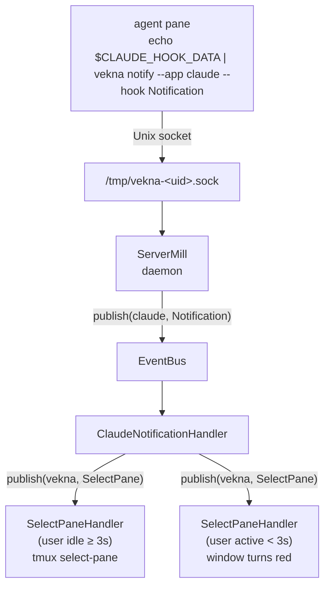

# vekna

Overseer for multiple Claude Code (or any coding agent) instances running in
tmux. One agent calls `vekna notify` → tmux jumps to its pane.

## Requires

- Python 3.10+
- `tmux` installed

## Install

```bash
pip install .
```

## Usage

### Starting a project session

Run `vekna` from any project directory:

```bash
cd ~/projects/myapp
vekna
```

This starts a background daemon (if not already running) and attaches you
to a dedicated tmux session for that directory (`vekna-myapp-<hash>`). Open
windows with `Ctrl-b c` and run a coding agent in each.

Run `vekna` from a second project in another terminal:

```bash
cd ~/projects/api
vekna
```

Both sessions share a single daemon — one socket, one process, all projects.

### Switching between sessions

| Keys | Action |
|------|--------|
| `Ctrl-b s` | Interactive session picker (all vekna sessions listed) |
| `Ctrl-b )` / `Ctrl-b (` | Next / previous session |
| `Ctrl-b d` | Detach — return to the terminal you launched `vekna` from |

After detaching, run `vekna` again from the same directory to reattach.

### Claude Code configuration

Add a notification hook in Claude Code settings:

```
echo "$CLAUDE_HOOK_DATA" | vekna notify --app claude --hook Notification
```

`--app` and `--hook` are required. The payload is read from stdin and the
target pane is picked up from `$TMUX_PANE` automatically.

### Status bar

To show pending notification counts across all sessions, add this to your
`~/.tmux.conf`:

```
set -g status-right '#(vekna status-bar)'
```

> **Note:** tmux runs status bar commands with a limited `PATH`. If `vekna`
> is not installed globally (e.g. it lives in a virtualenv), use the full
> path instead:
>
> ```
> set -g status-right '#(/path/to/vekna status-bar)'
> ```
>
> Find the path with `which vekna`. To install globally, use
> `pipx install .` from the repo root.

Output looks like `myapp(2) api(1)` when agents in those sessions are
waiting. The count resets when you run `vekna` from that directory again
(i.e. when you attach to the session).

### Commands

| Command | Effect |
|---------|--------|
| `vekna` | Ensure daemon running, create session for current directory, attach |
| `vekna daemon` | Start the daemon explicitly (blocks; use for init systems or debugging) |
| `vekna notify --app <app> --hook <hook>` | Send a notification from the current pane; payload from stdin, pane from `$TMUX_PANE` |
| `vekna status-bar` | Print pending notification summary (empty if daemon not running) |

## How it works



- One daemon owns `/tmp/vekna-<uid>.sock` and manages all sessions. `vekna`
  starts it automatically on first use via `os.fork()`.
- `vekna` sends an `EnsureSession{cwd}` request to the daemon, receives back
  the session name, and calls `tmux attach-session` to hand control to tmux.
- `vekna notify` sends a `(claude, Notification)` event to the daemon socket.
  The daemon increments the pending count for that session and publishes the
  event to the `EventBus`.
- **ClaudeNotificationHandler** validates the payload and re-publishes a
  `(vekna, SelectPane)` event carrying the pane ID.
- **SelectPaneHandler** handles `SelectPane`:
  - If the session has been idle for at least 3 s, calls `tmux select-pane`
    to jump to the notifying pane immediately.
  - Otherwise, highlights the notifying window red. A background loop
    (`clear_marks_loop`) clears the mark once the user navigates to it.
- `vekna status-bar` sends a `(vekna, StatusBar)` request; the daemon
  responds with a formatted summary of all sessions with pending counts.

Session naming (`vekna-<basename>-<hash>`) lives in `src/vekna/specs/constants.py`.

## Architecture

GLIMPSE layering (enforced by `import-linter`):

| Layer | Role |
|-------|------|
| `pacts` | Protocols, DTOs (pydantic) |
| `specs` | Constants |
| `mills` | Business logic (`ServerMill`, `NotifyClientMill`, `EventBus`, handlers) |
| `links` | I/O adapters (`TmuxLink`, `SocketServerLink`, `SocketClientLink`) |
| `gates` | Entry points (`ClickGate` — CLI) |
| `inits` | Wiring — registers handlers and starts background tasks |
| `edges` | Infra boundary |

Import rules in `pyproject.toml` under `[tool.importlinter]`.

## Development

```bash
mise run start      # dev server :8000
mise run test       # all tests
mise run check      # format + lint
```

Tooling: black, ruff (`select = ["ALL"]`), mypy strict, import-linter,
pytest, vulture, deptry, codespell, pip-audit.

## License

BSD-3-Clause. See `LICENSE`.
